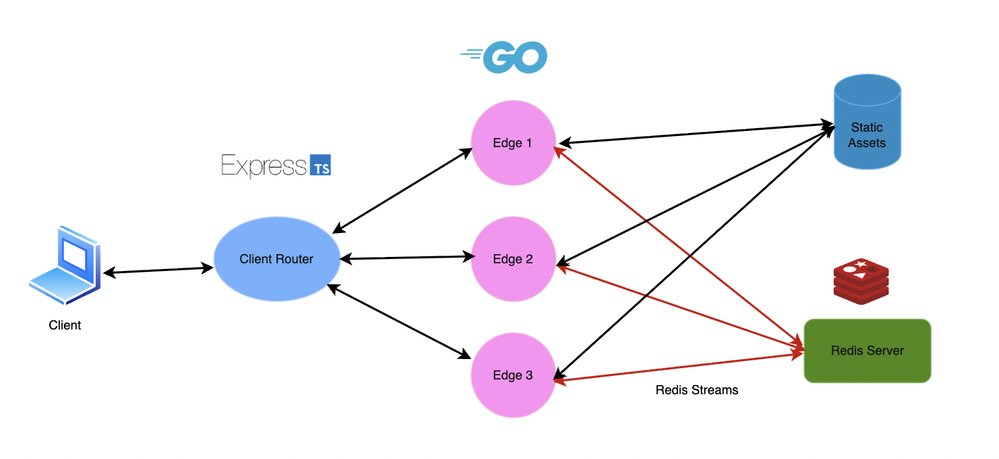

# edgeCache

I was bored and wanted to better understand the core principles of a distributed content delivery system (CDN) in a lightweight, simpler way. This project shows how static assets can be served from multiple edge nodes with:
* Low latency and high availibility through distributed Go servers
* Consistent cache synchronization across nodes using Redis Streams
* Smart client-side routing that selects the nearest node based on simulated network latency (simulated for now lol)

It's not really meant to be production-ready, but its rather an educational and extensible foundation that captures the fundamentals of distributed systems, caching, and routing.

## Architecture + Diagram

## Components

### Edge Nodes (Go + Docker)
* Three lightweight HTTP servers built in Go
* Each serves static files from an assets/ directory
* Maintains its own in-memory cache with TTLs
* Listens to Redis Stream events to invalidate cache entries across the cluster

### Redis (Message Bus)
* Single Redis container (using Redis Streams)
* Acts as the “control plane” for broadcasting cache invalidation events to all edge nodes

### Client Router (TypeScript + Express)
* A Node.js/Express service that acts as a simple client-facing router
* Compares all edge nodes’ /ping endpoints and dynamically selects the nearest one
* Forwards the request to the chosen edge node and returns the asset to the client

## Sooo, why these technologies?

### Go for Edge Nodes
Go is fast and has a simple built-in HTTP server. It’s lighter and easier to deploy than something like Java or Node for backend servers, which makes it a better fit for small, containerized edge nodes.

## TypeScript + Express for Client Router
Express is simpler to set up than heavier frameworks like NestJS. This makes it the easiest way to write a clear, minimal client router.

## Redis Streams for Invalidation
Redis Streams are lightweight and real-time. They’re much easier to use than setting up Kafka or RabbitMQ, while still showing distributed pub/sub concepts. It's ideal for a lightweight demo that needs cache synchronization.

## Docker + Docker Compose for Orchestration
Docker makes each component self-contained, and Compose is easier to run locally than Kubernetes. Together they let you run up the whole system with one command, without the overhead of cloud deployment tools.

## TODOS:
- show hit and misses on demo
- make the simple cache into an LRU
- Replace simulated latency with real RTT